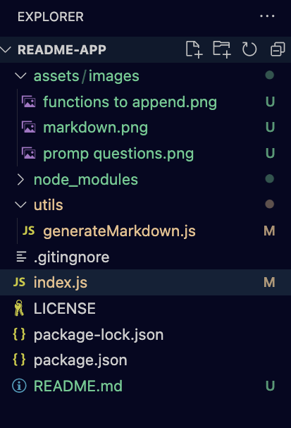
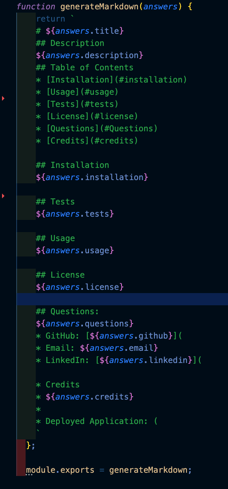
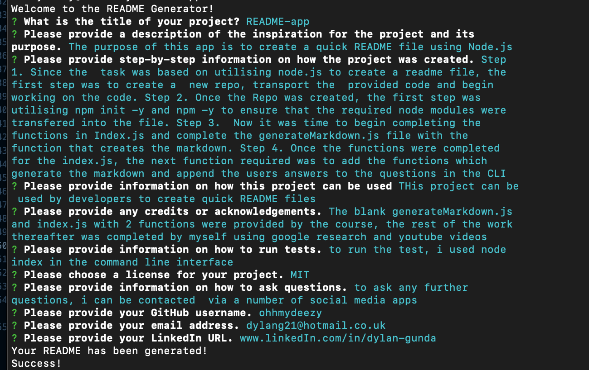

    # README-app
    ## Description
    The purpose of this app is to create a quick README file using Node.js
    ## Table of Contents
    * [Installation](#installation)
    * [Usage](#usage)
    * [Tests](#tests)
    * [License](#license)
    * [Questions](#Questions)
    * [Credits](#credits)
    
    ## Installation
    Step 1. Since the  task was based on utilising node.js to create a readme file, the  first step was to create a  new repo, transport the  provided code and begin working on the code. 

    Step 2. Once the Repo was created, the first step was utilising npm init -y and npm -y to ensure that the required node modules were transfered into the file. 

    Step 3.  Now it was time to begin completing the functions in Index.js and complete the generateMarkdown.js file with the function that creates the markdown. 

    
    Step 4. Once the functions were completed for the index.js, the next function required was to add the functions which generate the markdown and append the users answers to the questions in the CLI 

    

    ## Tests
    to run the test, i used node index in the command line interface

    ## Usage
    THis project can be used by developers to create quick README files

    ## License
    MIT

    ## Questions:
    to ask any further questions, i can be contacted  via a number of social media apps
    * GitHub: [ohhmydeezy]
    * Email: dylang21@hotmail.co.uk
    * LinkedIn: [www.linkedIn.com/in/dylan-gunda]
    

    Final Product: 

    * Credits
    * The blank generateMarkdown.js and index.js with 2 functions were provided by the course, the rest of the work thereafter was completed by myself using google research and youtube videos
    